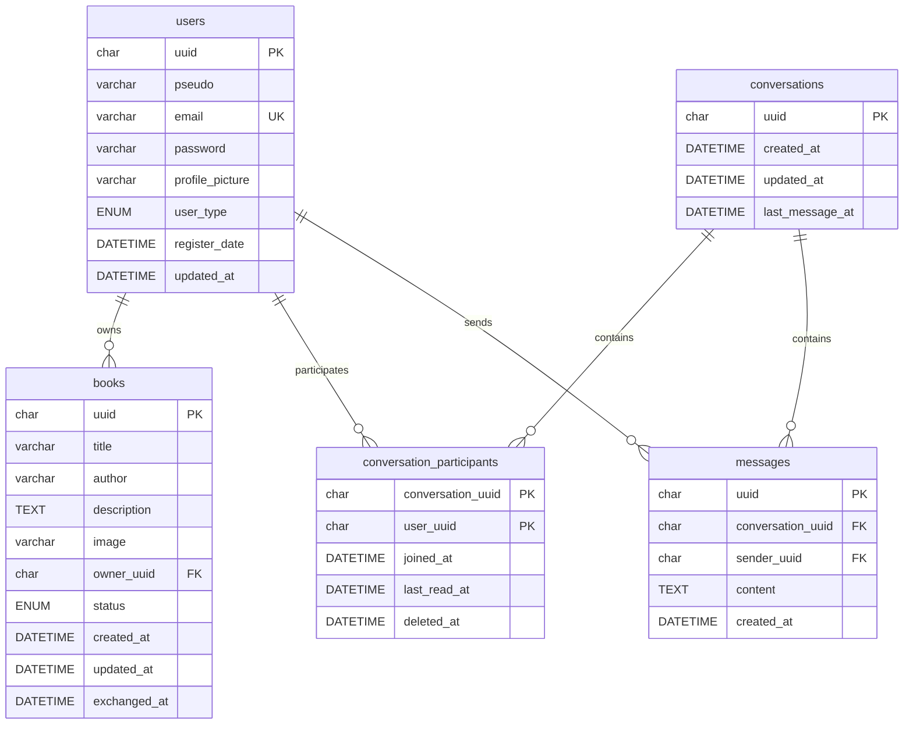

# OpenClassroom_PHP_site_de_mise_en_relation

## TomTroc

Le but de ce projet est de réaliser un site permettant la mise en contact de
lecteurs, afin qu'ils puissent partager et échanger leurs livres.
Ce projet est un MVP, c'est-à-dire "Minimal Viable Product", une première
version qui doit fonctionner mais sera rapidement améliorée à l'avenir.

## Styles

Les styles principaux sont organises en Sass dans `public/assets/scss`.
Le fichier servi par l'application est `public/assets/css/main.css`.

## Base de donnees

Le schema SQL se trouve dans `database/schema.sql`.
Il cree la base `tom_troc` si besoin ainsi que les tables necessaires aux
utilisateurs, aux livres et a la messagerie.

Les variables de connexion sont lues depuis un fichier `.env` a la racine du
projet. Un exemple est fourni dans `.env.example`.

Avec XAMPP, il peut etre importe depuis phpMyAdmin ou en ligne de commande :

```bash
mysql -u root < database/schema.sql
```

### Compte administrateur

Les comptes crees depuis l'application sont toujours de type `user`.
Pour donner l'acces a l'administration, il faut promouvoir manuellement un
utilisateur en base de donnees :

```sql
UPDATE users
SET user_type = 'admin'
WHERE email = 'admin@example.com';
```

Apres modification, deconnectez puis reconnectez ce compte pour que la session
recupere le nouveau type utilisateur. La page `index.php?page=admin` devient
alors accessible et le lien `Admin` apparait dans le header.

### Schema relationnel



### Relations

- Un utilisateur peut posseder zero, un ou plusieurs livres. Chaque livre appartient a un seul utilisateur via `books.owner_uuid`.
- Une conversation peut regrouper plusieurs participants. Chaque participation rattache une conversation a un utilisateur via `conversation_participants.conversation_uuid` et `conversation_participants.user_uuid`.
- Un utilisateur peut participer a zero, une ou plusieurs conversations. Cette relation passe par la table de liaison `conversation_participants`.
- Une conversation peut contenir zero, un ou plusieurs messages. Chaque message appartient a une seule conversation via `messages.conversation_uuid`.
- Un utilisateur peut envoyer zero, un ou plusieurs messages. Chaque message possede un seul expediteur via `messages.sender_uuid`.
- Les suppressions liees aux relations principales utilisent `ON DELETE CASCADE`.

### Dictionnaire de donnees

#### `users`

| Champ | Type | Contraintes | Description |
| --- | --- | --- | --- |
| `uuid` | `CHAR(36)` | Cle primaire | Identifiant unique de l'utilisateur. |
| `pseudo` | `VARCHAR(80)` | Index | Pseudo affiche dans l'application. |
| `email` | `VARCHAR(190)` | Unique | Adresse email utilisee pour la connexion. |
| `password` | `VARCHAR(255)` | Obligatoire | Mot de passe hache. |
| `profile_picture` | `VARCHAR(255)` | Defaut `assets/images/Alexlecture.png` | Chemin de la photo de profil. |
| `user_type` | `ENUM('user', 'admin')` | Defaut `user` | Role applicatif de l'utilisateur. |
| `register_date` | `DATETIME` | Defaut `CURRENT_TIMESTAMP` | Date d'inscription. |
| `updated_at` | `DATETIME` | Nullable | Date de derniere modification du profil. |

#### `books`

| Champ | Type | Contraintes | Description |
| --- | --- | --- | --- |
| `uuid` | `CHAR(36)` | Cle primaire | Identifiant unique du livre. |
| `title` | `VARCHAR(190)` | Obligatoire | Titre du livre. |
| `author` | `VARCHAR(190)` | Obligatoire | Auteur du livre. |
| `description` | `TEXT` | Obligatoire | Description ou commentaire du proprietaire. |
| `image` | `VARCHAR(255)` | Obligatoire | Chemin de l'image du livre. |
| `owner_uuid` | `CHAR(36)` | Cle etrangere vers `users.uuid`, index | Proprietaire du livre. |
| `status` | `ENUM('available', 'reserved', 'exchanged', 'removed')` | Defaut `available`, index | Statut de disponibilite du livre. |
| `created_at` | `DATETIME` | Defaut `CURRENT_TIMESTAMP` | Date d'ajout du livre. |
| `updated_at` | `DATETIME` | Nullable | Date de derniere modification du livre. |
| `exchanged_at` | `DATETIME` | Nullable | Date a laquelle le livre a ete echange. |

#### `conversations`

| Champ | Type | Contraintes | Description |
| --- | --- | --- | --- |
| `uuid` | `CHAR(36)` | Cle primaire | Identifiant unique de la conversation. |
| `created_at` | `DATETIME` | Defaut `CURRENT_TIMESTAMP` | Date de creation de la conversation. |
| `updated_at` | `DATETIME` | Nullable | Date de derniere modification de la conversation. |
| `last_message_at` | `DATETIME` | Nullable, index | Date du dernier message, utilisee pour trier la messagerie. |

#### `conversation_participants`

| Champ | Type | Contraintes | Description |
| --- | --- | --- | --- |
| `conversation_uuid` | `CHAR(36)` | Cle primaire composee, cle etrangere vers `conversations.uuid` | Conversation concernee. |
| `user_uuid` | `CHAR(36)` | Cle primaire composee, cle etrangere vers `users.uuid`, index | Participant de la conversation. |
| `joined_at` | `DATETIME` | Defaut `CURRENT_TIMESTAMP` | Date d'arrivee dans la conversation. |
| `last_read_at` | `DATETIME` | Nullable, index | Date de derniere lecture du participant. |
| `deleted_at` | `DATETIME` | Nullable | Date de suppression logique de la conversation pour ce participant. |

#### `messages`

| Champ | Type | Contraintes | Description |
| --- | --- | --- | --- |
| `uuid` | `CHAR(36)` | Cle primaire | Identifiant unique du message. |
| `conversation_uuid` | `CHAR(36)` | Cle etrangere vers `conversations.uuid`, index compose | Conversation du message. |
| `sender_uuid` | `CHAR(36)` | Cle etrangere vers `users.uuid`, index | Utilisateur qui a envoye le message. |
| `content` | `TEXT` | Obligatoire | Contenu du message. |
| `created_at` | `DATETIME` | Defaut `CURRENT_TIMESTAMP` | Date d'envoi du message. |
